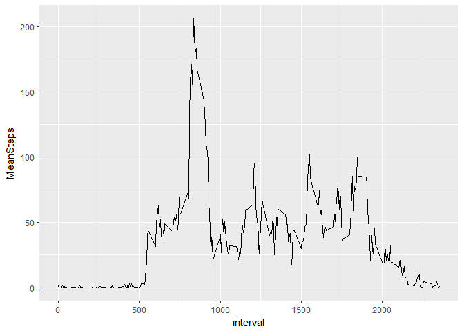
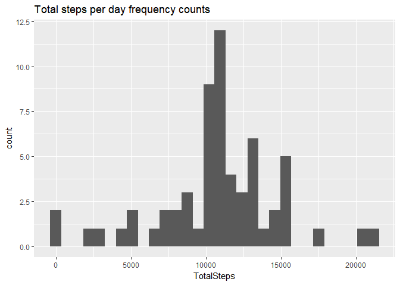
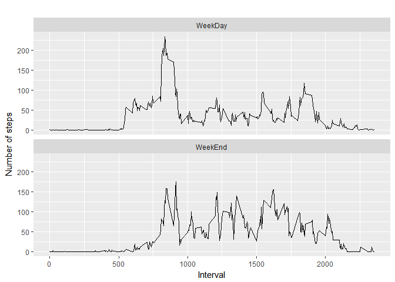

# Reproducible Research: Peer Assessment 1


## Load packages

```r
library(ggplot2)
library(dplyr)
```

```
## 
## Attaching package: 'dplyr'
```

```
## The following objects are masked from 'package:stats':
## 
##     filter, lag
```

```
## The following objects are masked from 'package:base':
## 
##     intersect, setdiff, setequal, union
```

```r
library(lubridate)
```

```
## 
## Attaching package: 'lubridate'
```

```
## The following object is masked from 'package:base':
## 
##     date
```

## Loading and preprocessing the data

```r
data<-read.csv("activity.csv", stringsAsFactors=FALSE)
data<-data %>% mutate(date=ymd(date))
```

## What is mean total number of steps taken per day?

```r
byDay<-data %>% group_by(date) %>% summarise(TotalSteps=sum(steps, na.rm = TRUE))
ggplot(data = byDay, aes(TotalSteps)) + geom_histogram(bins = 20)+ggtitle("Total steps per day frequency counts")
```

<!-- -->

Mean of total steps by day

```r
mean(byDay$TotalSteps)
```

```
## [1] 9354.23
```
Median of total steps by day


```r
median(byDay$TotalSteps)
```

```
## [1] 10395
```

## What is the average daily activity pattern?

```r
byInterval<-data %>% group_by(interval) %>% summarise(MedianSteps=median(steps, na.rm=TRUE), MeanSteps=mean(steps, na.rm=TRUE))
ggplot(data = byInterval, aes(x=interval, y=MeanSteps)) + geom_line()
```

<!-- -->

Interval with the maximum mean total steps

```r
byInterval[which.max(byInterval$MeanSteps),1]
```

```
## # A tibble: 1 × 1
##   interval
##      <int>
## 1      835
```


## Imputing missing values

Total number of missing values

```r
sum(is.na(data$steps))
```

```
## [1] 2304
```

Impute some missing values

```r
inputed<-inner_join(x=data, y=byInterval, by=c("interval","interval"))
#we can use the mean for that interval if the value is missing
inputed$extra <- ifelse(!is.na(inputed$steps), inputed$steps, inputed$MeanSteps)
ibyDay<-inputed %>% group_by(date) %>% summarise(TotalSteps=sum(extra, na.rm = TRUE))
```

Total number of steps per day 


```r
ggplot(data = ibyDay, aes(TotalSteps)) + geom_histogram(bin=20)+ggtitle("Total steps per day frequency counts")
```

```
## Warning: Ignoring unknown parameters: bin
```

```
## `stat_bin()` using `bins = 30`. Pick better value with `binwidth`.
```

<!-- -->

Mean and median of total steps by day

```r
mean(ibyDay$TotalSteps)
```

```
## [1] 10766.19
```

```r
median(ibyDay$TotalSteps)
```

```
## [1] 10766.19
```


## Are there differences in activity patterns between weekdays and weekends?

```r
library(chron)
```

```
## 
## Attaching package: 'chron'
```

```
## The following objects are masked from 'package:lubridate':
## 
##     days, hours, minutes, seconds, years
```

```r
inputed$isweekend<-is.weekend(inputed$date)

byIntervalw<-inputed %>% group_by(interval, isweekend) %>% summarise(AverageSteps=median(steps, na.rm=TRUE), meanSteps=mean(steps, na.rm=TRUE))
library(lattice)
xyplot(data = byIntervalw, meanSteps ~ interval | isweekend, type="l")
```

<!-- -->
